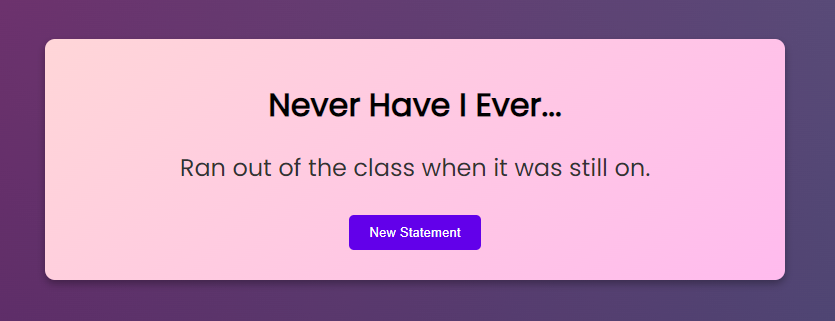

# Never Have I Ever

A simple web-based "Never Have I Ever" game built with HTML, CSS, and JavaScript. The game features multiple categories of statements, and users can navigate between categories and get random statements.

## Features

- Five categories: Popular, Teens, Party, Couple, Normal
- Random statements for each category
- Responsive design for different screen sizes
- Smooth animations and hover effects
- ~~Easy to add or modify statements via a JSON file~~



## Usage

1. **Choose a category:**
   - Click on one of the categories (Popular, Teens, Party, Couple, Normal) on the category screen.
   
2. **View a statement:**
   - A random "Never Have I Ever" statement from the chosen category will be displayed.
   
3. **Get a new statement:**
   - Click the "New Statement" button to get another random statement from the same category.
   
4. **Return to the category screen:**
   - Click the "Home" button to return to the category selection screen.

## Project Structure

```
never-have-i-ever-web-game/
│
├── index.html
├── src
│    ├── styles.css
│    ├── script.js
│    └── nhie.json
└── README.md
```

- `index.html`: The main HTML file that contains the structure of the game.
- `styles.css`: The CSS file for styling the game.
- `script.js`: The JavaScript file that contains the game logic.
- `nhie.json`: The JSON file that contains the statements for each category.
- `README.md`: The readme file you are currently reading.

## Contributing
Contributions are welcome! Please open an issue or submit a pull request for any improvements or bug fixes.

## License
This project is licensed under the MIT License. See the [LICENSE](LICENSE) file for more details.

## Contact

- [Twitter](https://twitter.com/arindal_17)
- [GitHub](https://github.com/arindal1)
- [LinkedIn](https://www.linkedin.com/in/arindalchar)

## Keep Coding 🚀
